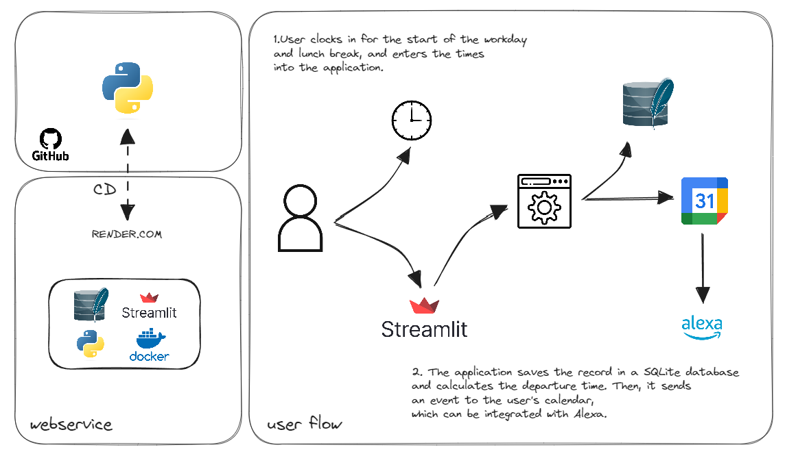

# Project Overview



## Project Description

**Title**: Work Hours Calculator

**Overview**:
The Work Hours Calculator project aims to streamline the process of determining optimal work hours by calculating entry and exit times based on an 8-hour workday. Initially developed as a personal tool in Jupyter Notebook, the project has evolved to serve a wider audience by providing a user-friendly interface through Streamlit.

**Motivation**:
The inspiration behind this project stemmed from the need to efficiently manage work hours while ensuring a healthy work-life balance. Recognizing the potential benefit to colleagues who also sought similar solutions, the decision was made to refactor the code and create a more accessible tool.

**Features**:
- **Calculation of Work Hours**: The core functionality of the project involves computing entry and exit times to meet the desired 8-hour workday.
- **Streamlit Interface**: The introduction of a Streamlit interface simplifies user interaction, making it easier for colleagues to utilize the tool.
- **Deployment on Render.com**: The project has been deployed as a web service on Render.com, utilizing Docker for containerization.
- **Future Enhancements**:
  - **Database Integration**: Incorporate and integrate a PostgreSQL database to persist user data. Currently, the project utilizes a SQLite database, which resets with each deployment.
  - **Docker Compose**: Implement Docker Compose to manage two separate containers (application and PostgreSQL), providing a more robust and scalable deployment solution.

**Conclusion**:
The Work Hours Calculator project, while initially conceived as a personal endeavor, has evolved into a collaborative tool aimed at enhancing productivity and work-life balance for users. With plans for future enhancements, including database integration and containerization with Docker Compose, the project demonstrates potential for continued development and improvement.


-------------------------------------------------------

Welcome to my calculadora ponto repo.

To use this project structure you will need to follow the steps below.

# Requirements
To use this project properly, you will need to install:
- [python](https://www.python.org/downloads/)
- [git](https://git-scm.com/downloads)
- [pyenv](https://pypi.org/project/pyenv/)
- [poetry](https://python-poetry.org/)

To install and configure Pyenv and Poetry in Windows, check [this video](https://www.youtube.com/watch?v=547Jr26duHQ&pp=ygUgaG93IHRvIGluc3RhbGwgcG9ldHJ5IGluIHdpbmRvd3M%3D).
To learn how to manage multiple python versions using pyenv, check [this article](https://realpython.com/intro-to-pyenv/).

# Poetry local environment config

To create the .venv local folder, type in terminal:
*for this project only, add the argument --local at the end of the command. Below is the poetry global settings.
```bash
poetry config virtualenvs.create true
poetry config virtualenvs.in-project true
```

# Installation Steps

## Git Clone
Open a terminal window (cmd, bash, or anything with git commands) and type:
```bash
git clone https://github.com/alanceloth/calculadoraPonto.git
cd calculadoraPonto
git init
```

## Create new GitHub Repo from existing one
In the terminal window, type:
```bash
gh repo create
```
Choose the third option: Push an existing local repository to GitHub.
Choose the current path (just put a dot "." and hit enter)
Follow the instructions on screen, add a remote called 'master', and that's it!

## Setting up the environment
We will need python 3.12.2, and to get this version we will use pyenv.
In the same terminal window, type:

If you never used pyenv, or if you don't have the 3.12.2 version in your pyenv:
```bash
pyenv update
pyenv install --l
```

If you find the 3.12.2, then it's everything correct.
```bash
pyenv install 3.12.2
```

To check the python versions installed, use this:
```bash
pyenv versions
```

You will notice that one of the versions will have a * symbol. This indicates that the system is using this version.
You can also check the default python version used by the system with this:
```bash
which python
```

If you have the 3.12.2 version in your pyenv:
To use the project python version (3.12.2), use the command below:
```bash
pyenv local 3.12.2
```

## Poetry

To initialize the poetry in the project, type in the terminal:
```bash
poetry env use 3.12.2
poetry shell
poetry install --no-root
```


# Contact

LinkedIn: [Alan Lanceloth Rodrigues Silva](https://www.linkedin.com/in/alanlanceloth/)

E-mail: [alan.lanceloth@gmail.com](mailto:alan.lanceloth@gmail.com)